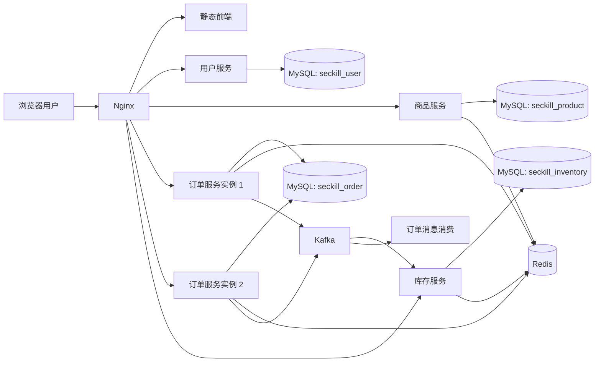
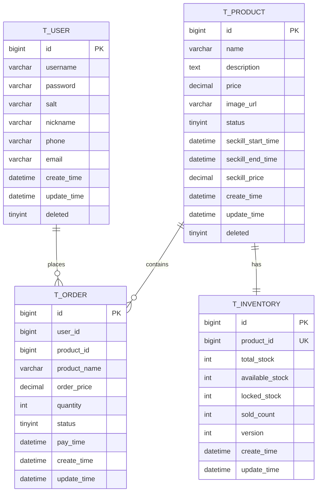

# 分布式秒杀系统设计文档

## 1. 项目目标

本项目以“秒杀商城”为业务场景，实现课程要求中的分布式基础能力，包括服务拆分、容器化部署、负载均衡、动静分离、缓存、消息队列和最终一致性等。

## 2. 系统架构草图



## 3. 服务拆分

### 用户服务 `seckill-user`

- 用户注册
- 用户登录
- JWT 令牌发放
- 用户信息查询

### 商品服务 `seckill-product`

- 商品列表
- 商品详情
- 商品缓存
- 缓存失效

### 库存服务 `seckill-inventory`

- 商品库存初始化
- Redis 库存预热
- 库存预扣减
- 数据库库存确认扣减与回滚

### 订单服务 `seckill-order`

- 秒杀下单
- 按订单 ID 查询
- 按用户 ID 查询
- 模拟支付
- 取消订单
- Kafka 异步创建订单

## 4. API 接口定义

## 用户服务

| 方法 | 路径 | 说明 |
| --- | --- | --- |
| `POST` | `/api/user/register` | 用户注册 |
| `POST` | `/api/user/login` | 用户登录 |
| `GET` | `/api/user/{id}` | 查询用户 |
| `GET` | `/api/user/health` | 健康检查 |

## 商品服务

| 方法 | 路径 | 说明 |
| --- | --- | --- |
| `GET` | `/api/product/{id}` | 商品详情 |
| `GET` | `/api/product/list` | 商品分页列表 |
| `POST` | `/api/product` | 创建商品 |
| `DELETE` | `/api/product/cache/{id}` | 清理商品缓存 |
| `GET` | `/api/product/health` | 健康检查 |

## 订单服务

| 方法 | 路径 | 说明 |
| --- | --- | --- |
| `POST` | `/api/order/seckill` | 秒杀下单 |
| `GET` | `/api/order/{orderId}` | 查询订单 |
| `GET` | `/api/order/user/{userId}` | 查询用户订单 |
| `POST` | `/api/order/{orderId}/pay` | 模拟支付 |
| `POST` | `/api/order/{orderId}/cancel` | 取消订单 |
| `GET` | `/api/order/health` | 健康检查 |

## 库存服务

| 方法 | 路径 | 说明 |
| --- | --- | --- |
| `GET` | `/api/inventory/{productId}` | 查询库存 |
| `POST` | `/api/inventory/init` | 初始化库存 |
| `POST` | `/api/inventory/preload/{productId}` | 预热库存到 Redis |
| `GET` | `/api/inventory/health` | 健康检查 |

## 5. 数据库 ER 图



## 6. 技术栈选型说明

| 类别 | 选型 |
| --- | --- |
| 编程语言 | Java 17 |
| 后端框架 | Spring Boot 3.2.5 |
| ORM | MyBatis-Plus 3.5.6 |
| 数据库 | MySQL 8 |
| 缓存 | Redis 7 |
| 消息队列 | Kafka 7.5 |
| 反向代理 | Nginx |
| 容器编排 | Docker Compose |
| 鉴权 | JWT |
| ID 生成 | 雪花算法 + 基因式路由位 |

## 7. 核心设计说明

### 7.1 负载均衡

- `user_backend` 使用轮询
- `order_backend` 使用 `ip_hash`
- `inventory_backend` 使用 `least_conn`
- 静态资源由 Nginx 直接处理

### 7.2 动静分离

- `/static/**` 直接命中 Nginx 静态目录
- `/api/**` 反向代理到对应服务
- 前端页面只通过浏览器调用 API，不与数据库直接通信

### 7.3 缓存设计

- 商品详情缓存到 Redis
- 使用空值缓存处理缓存穿透
- 使用互斥锁处理缓存击穿
- 使用随机 TTL 缓解缓存雪崩

### 7.4 秒杀链路

1. 用户登录获取 JWT
2. 订单服务校验幂等与秒杀资格
3. Redis Lua 原子预扣减库存
4. 订单服务生成雪花订单号
5. Kafka 异步投递订单创建消息
6. 库存服务消费消息并扣减数据库库存
7. 支付/取消时再次通过消息完成库存确认或回滚

### 7.5 一致性策略

- Redis 负责高并发入口的库存预扣减
- MySQL 负责最终库存与订单落库
- Kafka 负责异步削峰与服务解耦
- 当前项目采用“基于消息的最终一致性”实现下单与库存扣减协调

## 8. 运行说明

### 8.1 打包

```powershell
mvn -DskipTests package
```

### 8.2 启动

```powershell
Copy-Item .env.example .env
docker compose up -d --build
```

### 8.3 默认宿主机端口

| 服务 | 端口 |
| --- | --- |
| Nginx | `18080` |
| MySQL 主库 | `13306` |
| MySQL 从库 | `13307` |
| Redis | `16379` |
| Kafka | `19092` |

## 9. 已知待补强项

- `mysql-slave` 已在容器层准备，但主从复制初始化与代码级读写路由尚未闭环
- `seckill-gateway` 模块已存在，但尚未补齐 Spring Cloud Gateway + Nacos 的动态路由实现
- 熔断、限流、降级与 JMeter 压测结果仍需继续补全

