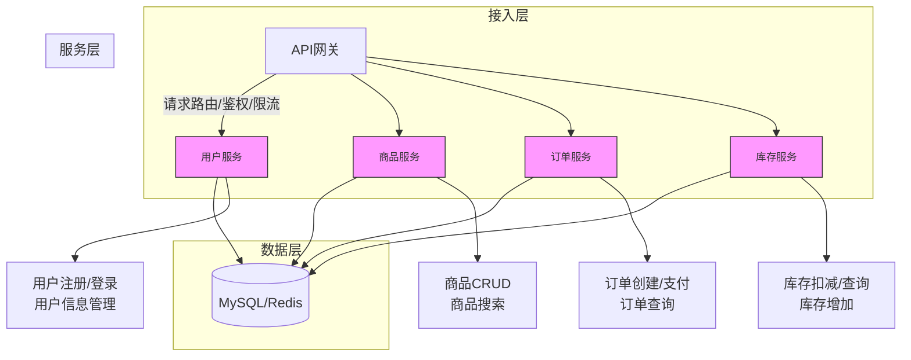
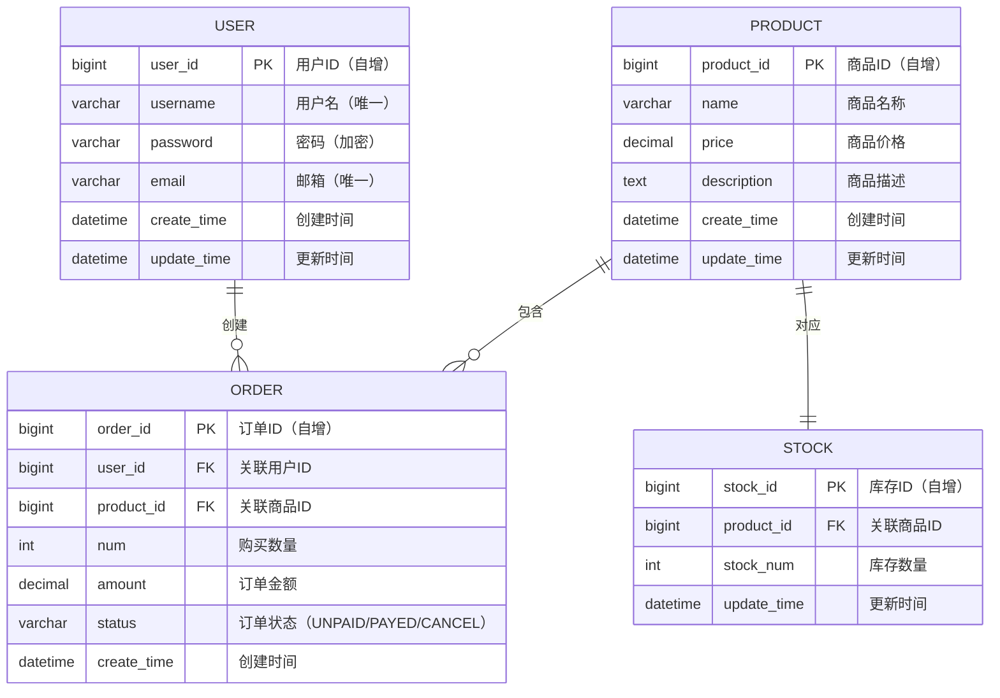

# 系统设计文档
## 一、系统架构图

### 1.1 架构说明
- **接入层**：基于 Spring Cloud Gateway 实现 API 网关，统一处理请求路由、身份鉴权、流量限流等通用能力；
- **服务层**：按业务域拆分为用户、商品、订单、库存四大微服务，各服务独立部署、独立维护，降低耦合；
- **数据层**：采用 MySQL 存储核心业务数据（分库分表），Redis 缓存热点数据（如商品信息、用户会话），提升访问性能。

## 二、各服务RESTful API接口定义
### 2.1 用户服务API
| 请求方法 | 接口路径                | 接口功能         | 请求参数示例                          | 响应示例                                  |
|----------|-------------------------|------------------|---------------------------------------|-------------------------------------------|
| POST     | /api/v1/users/register  | 用户注册         | `{"username":"test","password":"123456","email":"test@xxx.com"}` | `{"code":200,"msg":"注册成功","data":{"userId":1001}}` |
| POST     | /api/v1/users/login     | 用户登录         | `{"username":"test","password":"123456"}` | `{"code":200,"msg":"登录成功","data":{"token":"xxx"}}` |
| GET      | /api/v1/users/{userId}  | 获取用户信息     | 路径参数：userId                      | `{"code":200,"data":{"username":"test","email":"test@xxx.com"}}` |
| PUT      | /api/v1/users/{userId}  | 修改用户信息     | `{"nickname":"测试用户"}`             | `{"code":200,"msg":"修改成功"}`            |

### 2.2 商品服务API
| 请求方法 | 接口路径                | 接口功能         | 请求参数示例                          | 响应示例                                  |
|----------|-------------------------|------------------|---------------------------------------|-------------------------------------------|
| POST     | /api/v1/products        | 新增商品         | `{"name":"手机","price":2999,"stock":100}` | `{"code":200,"msg":"新增成功","data":{"productId":2001}}` |
| GET      | /api/v1/products/{productId} | 获取商品详情 | 路径参数：productId                  | `{"code":200,"data":{"name":"手机","price":2999}}` |
| GET      | /api/v1/products        | 分页查询商品     | 分页参数：page=1&size=10              | `{"code":200,"data":{"list":[...],"total":50}}` |
| PUT      | /api/v1/products/{productId} | 修改商品信息 | `{"price":2899}`                     | `{"code":200,"msg":"修改成功"}`            |

### 2.3 订单服务API
| 请求方法 | 接口路径                | 接口功能         | 请求参数示例                          | 响应示例                                  |
|----------|-------------------------|------------------|---------------------------------------|-------------------------------------------|
| POST     | /api/v1/orders          | 创建订单         | `{"userId":1001,"productId":2001,"num":1}` | `{"code":200,"msg":"创建成功","data":{"orderId":3001}}` |
| GET      | /api/v1/orders/{orderId} | 获取订单详情     | 路径参数：orderId                    | `{"code":200,"data":{"orderId":3001,"status":"UNPAID"}}` |
| PUT      | /api/v1/orders/{orderId}/pay | 订单支付     | `{"payType":"WECHAT"}`                | `{"code":200,"msg":"支付成功"}`            |

### 2.4 库存服务API
| 请求方法 | 接口路径                | 接口功能         | 请求参数示例                          | 响应示例                                  |
|----------|-------------------------|------------------|---------------------------------------|-------------------------------------------|
| GET      | /api/v1/stocks/{productId} | 查询商品库存   | 路径参数：productId                  | `{"code":200,"data":{"stock":99}}`         |
| PUT      | /api/v1/stocks/deduct   | 扣减库存         | `{"productId":2001,"num":1}`          | `{"code":200,"msg":"扣减成功","data":{"leftStock":98}}` |
| PUT      | /api/v1/stocks/add      | 增加库存         | `{"productId":2001,"num":10}`         | `{"code":200,"msg":"增加成功","data":{"leftStock":108}}` |

## 三、数据库设计
### 3.1 ER图

### 3.2 核心表结构说明
#### 用户表（user）
| 字段名       | 数据类型         | 主键 | 备注         |
|--------------|------------------|------|--------------|
| user_id      | BIGINT           | 是   | 自增主键     |
| username     | VARCHAR(50)      | 否   | 唯一         |
| password     | VARCHAR(100)     | 否   | 加密存储（MD5/SHA256） |
| email        | VARCHAR(100)     | 否   | 唯一         |
| create_time  | DATETIME         | 否   | 默认当前时间 |
| update_time  | DATETIME         | 否   | 默认当前时间 |

#### 商品表（product）
| 字段名       | 数据类型         | 主键 | 备注         |
|--------------|------------------|------|--------------|
| product_id   | BIGINT           | 是   | 自增主键     |
| name         | VARCHAR(100)     | 否   | 商品名称     |
| price        | DECIMAL(10,2)    | 否   | 商品价格     |
| description  | TEXT             | 否   | 商品描述     |
| create_time  | DATETIME         | 否   | 默认当前时间 |
| update_time  | DATETIME         | 否   | 默认当前时间 |

#### 库存表（stock）
| 字段名       | 数据类型         | 主键 | 备注         |
|--------------|------------------|------|--------------|
| stock_id     | BIGINT           | 是   | 自增主键     |
| product_id   | BIGINT           | 否   | 外键关联商品 |
| stock_num    | INT              | 否   | 库存数量     |
| update_time  | DATETIME         | 否   | 默认当前时间 |

#### 订单表（order）
| 字段名       | 数据类型         | 主键 | 备注         |
|--------------|------------------|------|--------------|
| order_id     | BIGINT           | 是   | 自增主键     |
| user_id      | BIGINT           | 否   | 外键关联用户 |
| product_id   | BIGINT           | 否   | 外键关联商品 |
| num          | INT              | 否   | 购买数量     |
| amount       | DECIMAL(10,2)    | 否   | 订单金额     |
| status       | VARCHAR(20)      | 否   | 订单状态（UNPAID/PAYED/CANCEL） |
| create_time  | DATETIME         | 否   | 默认当前时间 |

## 四、技术栈选型说明
### 4.1 核心技术栈
| 技术领域       | 选型框架/工具                | 选型理由                                                                 |
|----------------|-----------------------------|--------------------------------------------------------------------------|
| 编程语言       | Java 17 + Go 1.21（可选）   | Java 生态成熟，适配微服务开发；Go 性能优异，适合高并发的库存/订单服务      |
| 微服务框架     | Spring Cloud Alibaba        | 整合注册中心、配置中心、网关等组件，国内生态完善，适配企业级开发          |
| Web框架        | Spring Boot 3.x             | 快速开发Spring应用，自动配置减少配置工作量                                |
| API网关        | Spring Cloud Gateway        | 基于Netty的异步非阻塞网关，支持路由、限流、熔断等功能                      |
| 服务注册/配置  | Nacos                       | 同时支持服务注册发现和配置管理，轻量且高可用                              |
| 服务熔断/降级  | Sentinel                    | 阿里开源，适配Spring Cloud Alibaba，熔断规则配置灵活                      |
| ORM框架        | MyBatis-Plus                | 基于MyBatis增强，简化CRUD操作，支持分页、乐观锁等常用功能                  |

### 4.2 中间件选型
| 中间件类型     | 选型产品                    | 选型理由                                                                 |
|----------------|-----------------------------|--------------------------------------------------------------------------|
| 关系型数据库   | MySQL 8.0                   | 开源免费，性能稳定，支持分库分表，适配电商业务数据存储需求                |
| 缓存           | Redis 6.x                   | 高性能键值对数据库，用于用户会话、商品缓存、库存计数等热点数据存储        |
| 消息队列       | RocketMQ                    | 阿里开源，支持事务消息，适合订单支付、库存扣减等分布式事务场景            |
| 分布式事务     | Seata                       | 与Spring Cloud Alibaba适配，支持AT/TCC等事务模式，解决微服务数据一致性问题 |
| 搜索引擎       | Elasticsearch 7.x           | 用于商品全文检索，支持复杂条件筛选，提升商品搜索效率                      |

---
### 总结
1. 系统采用**微服务架构**，拆分为用户、商品、订单、库存四大核心服务，通过API网关统一接入，数据层分离存储；
2. 所有可视化图表（架构图、ER图）均采用**Mermaid语法**实现，可在主流Markdown编辑器中直接渲染；
3. 技术栈选型以**Spring Cloud Alibaba**为核心，适配国内企业级开发场景，兼顾性能、稳定性和易用性。